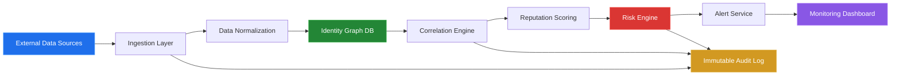
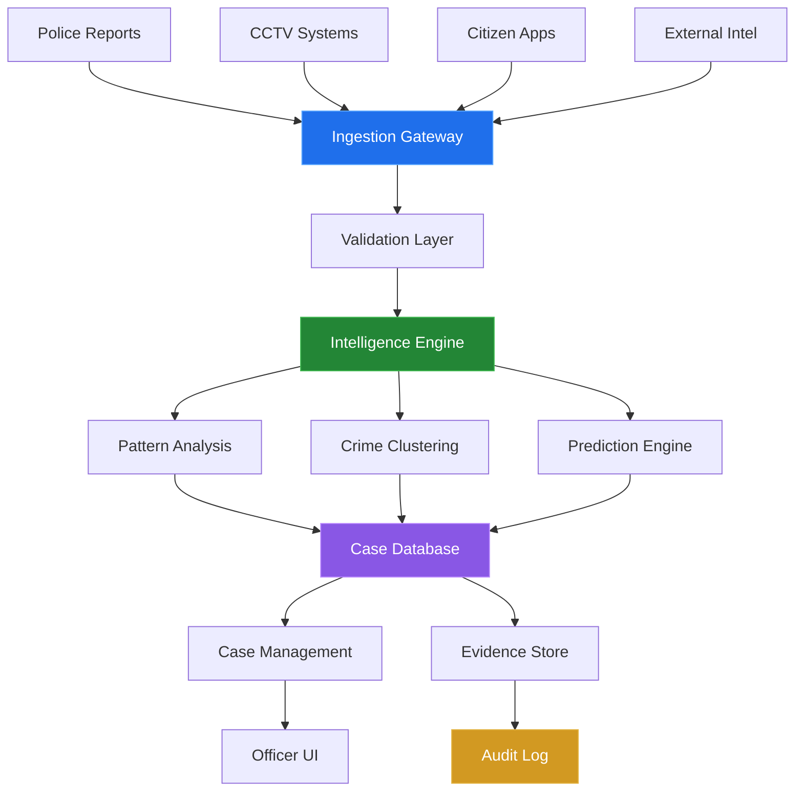
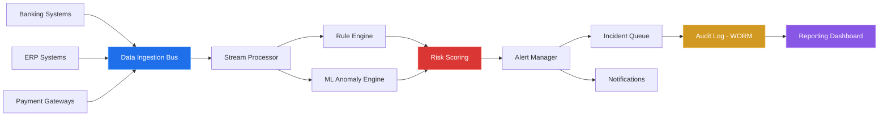

<!-- ═══════════════════════════════════════════════════════════════════════════ -->
<!--                        JACKSON KALLE — GITHUB PROFILE                    -->
<!-- ═══════════════════════════════════════════════════════════════════════════ -->

<div align="center">

<!-- ANIMATED HEADER BANNER -->


<!-- ANIMATED TYPING -->
<a href="https://github.com/jackkalle">
  
</a>

<br/>

<!-- PROFILE BADGES -->
[](https://github.com/jackkalle?tab=followers)
[](https://github.com/jackkalle?tab=stars)
[](https://github.com/jackkalle)

<!-- SOCIAL LINKS -->
<br/>

[](http://kalle.llc)
[](https://www.linkedin.com/in/jackson-kalle/)
[](https://x.com/jackkalle)
[](https://instagram.com/jackkalle)
[](https://web.facebook.com/Jackkalleofficial)

</div>

<br/>

<!-- ═══════════════════════════ ABOUT SECTION ═══════════════════════════════ -->


##  &nbsp;About Me

```yaml
Name:       Jackson Kalle
Title:      Systems Architect | Security & Digital Forensics Engineer
Company:    Kalle Group Technology
Location:   Nigeria
Focus:      Infrastructure-grade systems for institutional trust,
            operational control, and digital sovereignty

Experience: 7+ Years
Industries: Enterprise • Law Enforcement • Government • Financial Services
Impact:     Proven revenue impact up to 45%
```

> *"Systems fail where control is weak."*
> — Building systems that eliminate blind spots, enforce accountability, and withstand adversarial conditions.

<br/>

<!-- ═════════════════════════ CORE DOMAINS ══════════════════════════════════ -->


## 🏛️ &nbsp;Core Domains

<table>
<tr>
<td width="50%">

### 🔧 Systems Architecture
Engineering resilient systems designed for **scale**, **failure tolerance**, and **adversarial environments**. Every component is built to operate under pressure with zero single points of failure.

</td>
<td width="50%">

### 🔐 Cybersecurity & Digital Forensics
Building systems capable of **traceability**, **evidence preservation**, and **post-incident reconstruction**. From threat hunting to courtroom-ready audit trails.

</td>
</tr>
<tr>
<td width="50%">

### ⚙️ Infrastructure Automation
Replacing manual operations with **controlled**, **monitored**, and **auditable** system flows. Automating the critical — with human oversight where it matters.

</td>
<td width="50%">

### 🏢 Institutional Systems Engineering
Developing platforms for **law enforcement**, **enterprises**, and **regulated environments** where accountability and compliance are non-negotiable.

</td>
</tr>
</table>

<br/>

<!-- ═════════════════════ SECURITY PHILOSOPHY ═══════════════════════════════ -->


## 🛡️ &nbsp;Security Philosophy

<div align="center">

| Principle | Description |
|:---------:|:------------|
| 🔒 **Zero Trust Architecture** | Never trust, always verify — every request, every user, every device |
| 📋 **Auditability by Design** | Every action logged, every state change traceable, every decision accountable |
| 🛡️ **Abuse-Resistance First** | Systems designed for misuse scenarios — built to withstand the worst case |
| 📡 **Continuous Monitoring** | Real-time visibility into system health, threat landscape, and operational integrity |

</div>

<br/>

<!-- ═══════════════════ SIGNATURE SYSTEMS ═══════════════════════════════════ -->


## 🏗️ &nbsp;Signature Systems

<details open>
<summary><h3>🧠 RIAPS — Reputation Intelligence & Authority Preservation System</h3></summary>

<br/>

> Forensic-grade reputation intelligence infrastructure for identity trustworthiness evaluation, manipulation detection, and long-term authority integrity.

**Core Modules:**

| Module | Capability |
|--------|-----------|
| 🕸️ **Identity Graph Engine** | Relational identity maps (BVN, NIN, CAC, digital footprints) • Detects aliasing & identity overlap • Graph-based anomaly detection |
| 📊 **Reputation Scoring Engine** | Multi-factor behavioral, transactional & historical scoring • Weighted scoring with decay functions |
| 🎯 **Threat Intelligence Layer** | Impersonation detection • Coordinated reputation attack monitoring • Abnormal visibility spike analysis |
| 🔍 **Audit & Forensic Layer** | Immutable logs • Timeline reconstruction • Evidence export for legal proceedings |

**Architecture:**



**Deployment:** Government identity systems • Executive reputation protection • Corporate fraud detection

</details>

<details>
<summary><h3>🕵️ National Crime Index System</h3></summary>

<br/>

> Centralized intelligence infrastructure enabling real-time crime tracking, inter-agency collaboration, and evidence-based investigation.

**Core Modules:**

| Module | Capability |
|--------|-----------|
| 📥 **Crime Data Ingestion** | Police reports • CCTV integrations • Citizen reporting • External intelligence feeds |
| 🧩 **Intelligence Processing** | Pattern recognition • Crime clustering • Predictive hotspot analysis |
| 👤 **Suspect Profiling** | Identity linkage (NIN, BVN, vehicles) • Behavioral profiling • Movement tracking |
| 📁 **Case Management** | Case lifecycle tracking • Evidence attachment • Officer accountability logs |

**Architecture:**



**Deployment:** National law enforcement • Military intelligence • Border security systems

</details>

<details>
<summary><h3>💰 Financial Audit Engine</h3></summary>

<br/>

> Real-time financial transparency through automated auditing, anomaly detection, and fraud prevention.

**Core Modules:**

| Module | Capability |
|--------|-----------|
| 💳 **Transaction Monitoring** | Real-time financial data ingestion • Irregular flow pattern detection |
| 🚨 **Anomaly Detection** | Rule-based + AI-assisted detection • Risk scoring for accounts |
| 📜 **Audit Log System** | Immutable transaction records • Time-sequenced logs • Regulatory compliance export |
| ⚡ **Alert & Response** | Real-time alerts • Escalation workflows • Incident tracking |

**Architecture:**



**Deployment:** Banks • Enterprises • Government financial systems

</details>

<br/>

<!-- ════════════════════ ENTERPRISE AUTOMATION ══════════════════════════════ -->

<details>
<summary><h3>🏭 Enterprise Automation Engine</h3></summary>

<br/>

> Unified operational system for finance, inventory, staff control, and fraud detection — replacing fragmented manual processes with intelligent, monitored automation.

**Capabilities:** Financial operations automation • Inventory control systems • Staff management & access control • Cross-functional fraud detection

</details>

<br/>

<!-- ═══════════════════ THREAT MODELING ═════════════════════════════════════ -->


## ⚔️ &nbsp;Threat Modeling & Defensive Posture

<div align="center">

### Common Attack Vectors & Controls

| Attack Vector | Defensive Control |
|:-------------:|:-----------------|
| 💉 Data Injection / Poisoning | Input validation + Schema enforcement |
| 🔓 Privilege Escalation | Zero-trust RBAC + MFA |
| 📝 Log Tampering | Append-only immutable logs (WORM) |
| 🤖 API Abuse & Scraping | Rate limiting + API keys + Anomaly detection |
| 👤 Insider Threats | Full audit trails on every action |

</div>

<details>
<summary><b>🔬 STRIDE Analysis — RIAPS</b></summary>

| Threat | Mitigation |
|--------|-----------|
| **Spoofing** — Identity impersonation | Multi-source verification |
| **Tampering** — Data manipulation | Immutable logs |
| **Repudiation** — Denial of actions | Full audit trails |
| **Information Disclosure** — Data leaks | Encryption + RBAC |
| **Denial of Service** — API flooding | Rate limiting |
| **Elevation of Privilege** — Unauthorized access | Zero trust model |

</details>

<details>
<summary><b>🔬 MITRE ATT&CK Mapping — Crime Index</b></summary>

| Phase | Threat | Detection |
|-------|--------|-----------|
| Initial Access | Compromised reporting channel | Input validation |
| Persistence | Malicious data injection | Anomaly detection |
| Privilege Escalation | Insider misuse | RBAC enforcement |
| Defense Evasion | Log tampering attempts | WORM logging |
| Response | System compromise | Isolation + forensic review |

</details>

<br/>

<!-- ════════════════════ TECH STACK ═════════════════════════════════════════ -->


## 🛠️ &nbsp;Technology Arsenal

<div align="center">

#### Languages & Frameworks


#### Security & Forensics


#### Infrastructure & Cloud


#### Databases & Data


</div>

<br/>

<!-- ════════════════════ AUTHORITY SIGNALS ══════════════════════════════════ -->


## 📊 &nbsp;Authority Signals

<div align="center">

<table>
<tr>
<td align="center" width="33%">

### 7+
**Years of Experience**
<br/>Systems Architecture &<br/>Security Engineering

</td>
<td align="center" width="33%">

### 45%
**Revenue Impact**
<br/>Proven business results<br/>through automation

</td>
<td align="center" width="33%">

### Multi
**Industry Deployments**
<br/>Enterprise • Government<br/>• Law Enforcement

</td>
</tr>
</table>

</div>

<br/>

<!-- ════════════════════ GITHUB STATS ═══════════════════════════════════════ -->


## 📈 &nbsp;GitHub Analytics

<div align="center">


<br/><br/>


</div>

<br/>

<!-- ════════════════════ CONTRIBUTION GRAPH ═════════════════════════════════ -->


<br/>

<!-- ════════════════════ PINNED REPOS ═══════════════════════════════════════ -->


## 📌 &nbsp;Featured Repositories

<div align="center">

<a href="https://github.com/jackkalle/Knatsar-Antivirus">
  
</a>
<a href="https://github.com/jackkalle/Barter-Knatsar">
  
</a>
<a href="https://github.com/jackkalle/tarian">
  
</a>
<a href="https://github.com/jackkalle/unicorn">
  
</a>

</div>

<br/>

<!-- ═══════════════════ CASE STUDIES ════════════════════════════════════════ -->


## 📋 &nbsp;Case Studies

<details>
<summary><b>🧠 RIAPS — Identity Compromise & Recovery</b></summary>
<br/>

| Phase | Detail |
|-------|--------|
| **Context** | High-profile executive experiences identity impersonation across financial and digital platforms |
| **Problem** | Multiple fraudulent accounts • Reputation damage across digital channels • No unified tracing system |
| **Solution** | RIAPS deployed to map identity graph, detect anomalies, flag impersonation nodes, and initiate forensic trace |
| **Outcome** | ✅ Compromised identity clusters isolated • ✅ Fraudulent accounts flagged • ✅ Identity integrity restored • ✅ Continuous monitoring activated |

</details>

<details>
<summary><b>🕵️ Crime Index — National Police Deployment</b></summary>
<br/>

| Phase | Detail |
|-------|--------|
| **Context** | Fragmented crime data across multiple police divisions with no central intelligence system |
| **Problem** | Delayed investigations • Duplicate records • No cross-agency visibility |
| **Solution** | Centralized Crime Index System with unified reporting gateway, intelligence engine, and accountability logs |
| **Outcome** | ✅ Faster suspect identification • ✅ Reduced case duplication • ✅ Improved inter-agency coordination • ✅ Data-driven policing established |

</details>

<details>
<summary><b>💰 Audit Engine — Bank Fraud Detection</b></summary>
<br/>

| Phase | Detail |
|-------|--------|
| **Context** | Financial institution experiences undetected internal fraud and transaction manipulation |
| **Problem** | Hidden transaction anomalies • Weak audit trails • Delayed fraud detection |
| **Solution** | Audit Engine deployed with real-time monitoring, anomaly detection, and immutable audit logs |
| **Outcome** | ✅ Fraud patterns detected early • ✅ Financial leakage reduced • ✅ Audit compliance strengthened |

</details>

<br/>

<!-- ════════════════════ VISION ═════════════════════════════════════════════ -->


<div align="center">

## 🔭 &nbsp;Vision

### *Building systems that enable digital sovereignty, strengthen institutional trust, and operate reliably under pressure.*

<br/>

<!-- CONNECT CTA -->

[](mailto:contact@kalle.llc)
[](http://kalle.llc)
[](https://www.linkedin.com/in/jackson-kalle/)

<br/>

<!-- SNAKE ANIMATION -->
<picture>
  <source media="(prefers-color-scheme: dark)" srcset="https://raw.githubusercontent.com/jackkalle/jackkalle/output/github-snake-dark.svg" />
  <source media="(prefers-color-scheme: light)" srcset="https://raw.githubusercontent.com/jackkalle/jackkalle/output/github-snake.svg" />
  
</picture>

<br/><br/>

<!-- FOOTER -->


<sub>⚡ Designed with precision by <b>Jackson Kalle</b> — Kalle Group Technology</sub>

</div>
