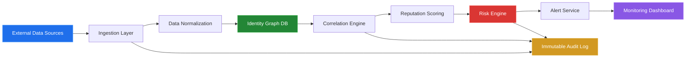
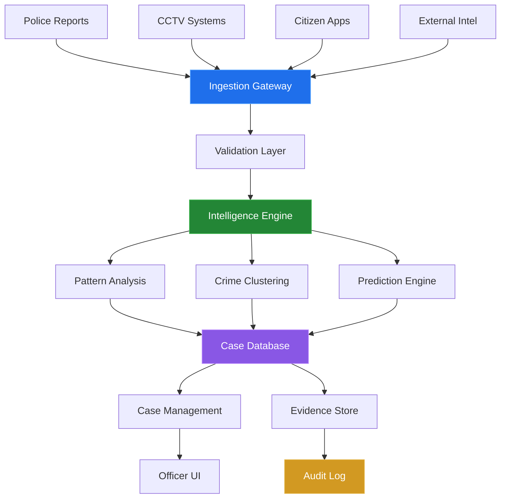
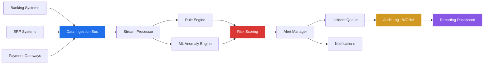

<!-- ═══════════════════════════════════════════════════════════════════════════ -->
<!--                        JACKSON KALLE — GITHUB PROFILE                    -->
<!--     Systems Architect | Security & Digital Forensics Engineer             -->
<!-- ═══════════════════════════════════════════════════════════════════════════ -->

<!-- NEURAL NETWORK ANIMATED BANNER -->

<!-- AI BRAIN CIRCUIT ANIMATION -->

<!-- ═══════════════════════════ HERO SECTION ════════════════════════════════ -->

<table>
<tr>
<td width="200" align="center">

  

</td>
<td>

## Jackson Kalle

**Kalle Group Technology** · Nigeria

Infrastructure-grade systems for institutional trust, operational control, and digital sovereignty.

 

</td>
</tr>
</table>

<!-- ANIMATED TYPING -->

<!-- ═══════════════════════ METRICS DASHBOARD ═══════════════════════════════ -->

<table>
<tr>
<td align="center" width="25%">

### 13+
**Years of Experience**
 Systems Architecture & Security Engineering

</td>
<td align="center" width="25%">

### 45%
**Revenue Impact**
 Proven business results through automation

</td>
<td align="center" width="25%">

### Multi
**Industry Deployments**
 Enterprise · Government · Law Enforcement

</td>
<td align="center" width="25%">

### 4
**Flagship Systems**
 RIAPS · Crime Index · Audit Engine · EAE

</td>
</tr>
</table>

<!-- ═══════════════════════ ABOUT + PHILOSOPHY ══════════════════════════════ -->

<table>
<tr>
<td width="50%" valign="top">

##  &nbsp;About Me

| | |
|:--|:--|
|  **Company** | Kalle Group Technology |
|  **Location** | Nigeria |
|  **Focus** | Infrastructure-grade systems for institutional trust, operational control, and digital sovereignty |
|  **Experience** | **13+ Years** — Architecture & Security |
|  **Impact** | Revenue impact up to **45%** |

 

> *"Systems fail where control is weak."*
> — Building systems that eliminate blind spots, enforce accountability, and withstand adversarial conditions.

</td>
<td width="50%" valign="top">

##  &nbsp;Security Philosophy

| Principle | Description |
|:---------:|:------------|
|  **Zero Trust** | Never trust, always verify — every request, every user, every device |
|  **Auditability** | Every action logged, every state change traceable, every decision accountable |
|  **Abuse-Resistance** | Systems designed for misuse scenarios — built to withstand the worst case |
|  **Monitoring** | Real-time visibility into system health, threat landscape, and integrity |

</td>
</tr>
</table>

<!-- ═════════════════════════ CORE DOMAINS ══════════════════════════════════ -->

##  &nbsp;Core Domains

<table>
<tr>
<td width="50%">

###  Systems Architecture
Engineering resilient systems designed for **scale**, **failure tolerance**, and **adversarial environments**. Every component is built to operate under pressure with zero single points of failure.

</td>
<td width="50%">

###  Cybersecurity & Digital Forensics
Building systems capable of **traceability**, **evidence preservation**, and **post-incident reconstruction**. From threat hunting to courtroom-ready audit trails.

</td>
</tr>
<tr>
<td width="50%">

###  Infrastructure Automation
Replacing manual operations with **controlled**, **monitored**, and **auditable** system flows. Automating the critical — with human oversight where it matters.

</td>
<td width="50%">

###  Institutional Systems Engineering
Developing platforms for **law enforcement**, **enterprises**, and **regulated environments** where accountability and compliance are non-negotiable.

</td>
</tr>
</table>

<!-- ═══════════════════ SIGNATURE SYSTEMS ═══════════════════════════════════ -->

##  &nbsp;Signature Systems

<h3> RIAPS — Reputation Intelligence & Authority Preservation System</h3>

 

> Forensic-grade reputation intelligence infrastructure for identity trustworthiness evaluation, manipulation detection, and long-term authority integrity.

**Core Modules:**

| Module | Capability |
|--------|-----------|
|  **Identity Graph Engine** | Relational identity maps (BVN, NIN, CAC, digital footprints) • Detects aliasing & identity overlap • Graph-based anomaly detection |
|  **Reputation Scoring Engine** | Multi-factor behavioral, transactional & historical scoring • Weighted scoring with decay functions |
|  **Threat Intelligence Layer** | Impersonation detection • Coordinated reputation attack monitoring • Abnormal visibility spike analysis |
|  **Audit & Forensic Layer** | Immutable logs • Timeline reconstruction • Evidence export for legal proceedings |

**Architecture:**

**Deployment:** Government identity systems • Executive reputation protection • Corporate fraud detection

<h3> National Crime Index System</h3>

 

> Centralized intelligence infrastructure enabling real-time crime tracking, inter-agency collaboration, and evidence-based investigation.

**Core Modules:**

| Module | Capability |
|--------|-----------|
|  **Crime Data Ingestion** | Police reports • CCTV integrations • Citizen reporting • External intelligence feeds |
|  **Intelligence Processing** | Pattern recognition • Crime clustering • Predictive hotspot analysis |
|  **Suspect Profiling** | Identity linkage (NIN, BVN, vehicles) • Behavioral profiling • Movement tracking |
|  **Case Management** | Case lifecycle tracking • Evidence attachment • Officer accountability logs |

**Architecture:**

**Deployment:** National law enforcement • Military intelligence • Border security systems

<h3> Financial Audit Engine</h3>

 

> Real-time financial transparency through automated auditing, anomaly detection, and fraud prevention.

**Core Modules:**

| Module | Capability |
|--------|-----------|
|  **Transaction Monitoring** | Real-time financial data ingestion • Irregular flow pattern detection |
|  **Anomaly Detection** | Rule-based + AI-assisted detection • Risk scoring for accounts |
|  **Audit Log System** | Immutable transaction records • Time-sequenced logs • Regulatory compliance export |
|  **Alert & Response** | Real-time alerts • Escalation workflows • Incident tracking |

**Architecture:**

**Deployment:** Banks • Enterprises • Government financial systems

<h3> Enterprise Automation Engine</h3>

 

> Unified operational system for finance, inventory, staff control, and fraud detection — replacing fragmented manual processes with intelligent, monitored automation.

**Capabilities:** Financial operations automation • Inventory control systems • Staff management & access control • Cross-functional fraud detection

<!-- ═══════════════════ THREAT MODELING ═════════════════════════════════════ -->

##  &nbsp;Threat Modeling & Defensive Posture

| Attack Vector | Defensive Control |
|:-------------|:-----------------|
|  **Data Injection / Poisoning** | Input validation + Schema enforcement |
|  **Privilege Escalation** | Zero-trust RBAC + MFA |
|  **Log Tampering** | Append-only immutable logs (WORM) |
|  **API Abuse & Scraping** | Rate limiting + API keys + Anomaly detection |
|  **Insider Threats** | Full audit trails on every action |

<b> STRIDE Analysis — RIAPS</b>

| Threat | Mitigation |
|--------|-----------|
| **Spoofing** — Identity impersonation | Multi-source verification |
| **Tampering** — Data manipulation | Immutable logs |
| **Repudiation** — Denial of actions | Full audit trails |
| **Information Disclosure** — Data leaks | Encryption + RBAC |
| **Denial of Service** — API flooding | Rate limiting |
| **Elevation of Privilege** — Unauthorized access | Zero trust model |

<b> MITRE ATT&CK Mapping — Crime Index</b>

| Phase | Threat | Detection |
|-------|--------|-----------|
| Initial Access | Compromised reporting channel | Input validation |
| Persistence | Malicious data injection | Anomaly detection |
| Privilege Escalation | Insider misuse | RBAC enforcement |
| Defense Evasion | Log tampering attempts | WORM logging |
| Response | System compromise | Isolation + forensic review |

<!-- ════════════════════ TECH STACK ═════════════════════════════════════════ -->

##  &nbsp;Technology Arsenal

**Languages & Frameworks**

**Security & Forensics**

**Infrastructure & Cloud**

**Databases & Data**

<!-- ════════════════════ GITHUB STATS ═══════════════════════════════════════ -->

##  &nbsp;GitHub Analytics

  

 

<!-- ════════════════════ CONTRIBUTION GRAPH ═════════════════════════════════ -->

<!-- ════════════════════ PINNED REPOS ═══════════════════════════════════════ -->

##  &nbsp;Featured Repositories

<!-- ═══════════════════ CASE STUDIES ════════════════════════════════════════ -->

##  &nbsp;Case Studies

<b> RIAPS — Identity Compromise & Recovery</b>

 

| Phase | Detail |
|-------|--------|
| **Context** | High-profile executive experiences identity impersonation across financial and digital platforms |
| **Problem** | Multiple fraudulent accounts • Reputation damage across digital channels • No unified tracing system |
| **Solution** | RIAPS deployed to map identity graph, detect anomalies, flag impersonation nodes, and initiate forensic trace |
| **Outcome** |  Compromised clusters isolated • Fraudulent accounts flagged • Identity integrity restored • Monitoring activated |

<b> Crime Index — National Police Deployment</b>

 

| Phase | Detail |
|-------|--------|
| **Context** | Fragmented crime data across multiple police divisions with no central intelligence system |
| **Problem** | Delayed investigations • Duplicate records • No cross-agency visibility |
| **Solution** | Centralized Crime Index System with unified reporting gateway, intelligence engine, and accountability logs |
| **Outcome** |  Faster identification • Reduced duplication • Improved coordination • Data-driven policing established |

<b> Audit Engine — Bank Fraud Detection</b>

 

| Phase | Detail |
|-------|--------|
| **Context** | Financial institution experiences undetected internal fraud and transaction manipulation |
| **Problem** | Hidden transaction anomalies • Weak audit trails • Delayed fraud detection |
| **Solution** | Audit Engine deployed with real-time monitoring, anomaly detection, and immutable audit logs |
| **Outcome** |  Fraud patterns detected early • Financial leakage reduced • Audit compliance strengthened |

<!-- ════════════════════ FOOTER ═════════════════════════════════════════════ -->

## 

### *Building systems that enable digital sovereignty, strengthen institutional trust, and operate reliably under pressure.*

 

 

<!-- AI BRAIN CIRCUIT FOOTER ANIMATION -->

<!-- SNAKE ANIMATION -->
<picture>
  <source media="(prefers-color-scheme: dark)" srcset="https://raw.githubusercontent.com/jackkalle/jackkalle/output/github-snake-dark.svg" />
  <source media="(prefers-color-scheme: light)" srcset="https://raw.githubusercontent.com/jackkalle/jackkalle/output/github-snake.svg" />
  
</picture>

  

<!-- FOOTER WAVE -->

 Architected with precision by <b>Jackson Kalle</b> — Kalle Group Technology

